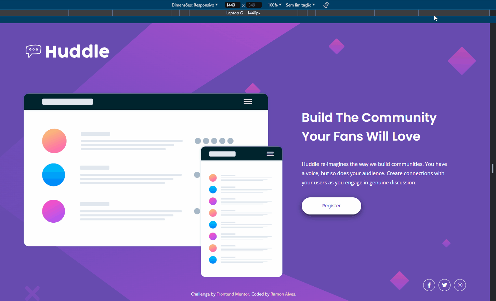

# Frontend Mentor - Huddle landing page with single introductory section solution

This is a solution to the [Huddle landing page with single introductory section challenge on Frontend Mentor](https://www.frontendmentor.io/challenges/huddle-landing-page-with-a-single-introductory-section-B_2Wvxgi0). Frontend Mentor challenges help you improve your coding skills by building realistic projects. 

## Overview

### The challenge

Users should be able to:

- View the optimal layout for the page depending on their device's screen size
- See hover states for all interactive elements on the page

## Screenshot

- ### Desktop Preview

- ### Responsivity

### Links

- Solution URL: [Frontend Mentor - Solution page](https://www.frontendmentor.io/solutions/-html5-e-css-15-newbie-huddle-landing-page-z-8WqqnJVh)
- Live Site URL: [Live Site](https://ramon-alvez.github.io/Frontend-Mentor-HTML-CSS-Newbie-Huddle-landing-page-with-a-single-introductory-section/)

## My process

### Built with

- Semantic HTML5 markup
- CSS custom properties
- Flexbox
- CSS Grid

### What I learned

I learned not to be overconfident in this challenge

### Continued development

My current goal is to finish all the FrontEnd Mentor challenges, to train and learn in the process. After finishing all HTML and CSS challenges, I will start JavaScript lessons.

## Author

- GitHub - [Ramon Alvez](https://github.com/Ramon-Alvez)
- Frontend Mentor - [@Ramon Alvez](https://www.frontendmentor.io/profile/Ramon-Alvez)
- LinkedIn - [@Ramon Alvez](https://www.linkedin.com/in/ramon-alvez/)
